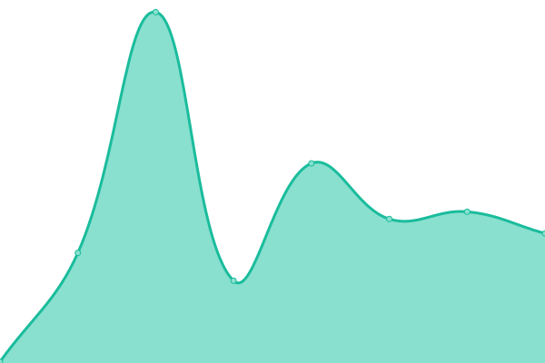

# [📈 Live Status](https://BuyWithCrypto.github.io/status): <!--live status--> **🟩 All systems operational**

This repository contains the open-source uptime monitor and status page for [BuyWithCrypto](https://buywithcrypto.fr), powered by [Upptime](https://github.com/upptime/upptime).

With [Upptime](https://upptime.js.org), you can get your own unlimited and free uptime monitor and status page, powered entirely by a GitHub repository. We use [Issues](https://github.com/BuyWithCrypto/status/issues) as incident reports, [Actions](https://github.com/BuyWithCrypto/status/actions) as uptime monitors, and [Pages](https://BuyWithCrypto.github.io/status) for the status page.

<!--start: status pages-->
<!-- This summary is generated by Upptime (https://github.com/upptime/upptime) -->
<!-- Do not edit this manually, your changes will be overwritten -->
<!-- prettier-ignore -->
| URL | Status | History | Response Time | Uptime |
| --- | ------ | ------- | ------------- | ------ |
|  [Website](https://buywithcrypto.fr/) | 🟩 Up | [website.yml](https://github.com/BuyWithCrypto/status/commits/HEAD/history/website.yml) | 

 321ms
     
 | 

<a href="https://status.buywithcrypto.fr/history/website">97.51%</a>
    

|  [Mobile Website](https://mobile.buywithcrypto.fr/) | 🟩 Up | [mobile-website.yml](https://github.com/BuyWithCrypto/status/commits/HEAD/history/mobile-website.yml) | 

 162ms
     
 | 

<a href="https://status.buywithcrypto.fr/history/mobile-website">97.51%</a>
    

|  [DApp](https://app.buywithcrypto.fr/) | 🟩 Up | [d-app.yml](https://github.com/BuyWithCrypto/status/commits/HEAD/history/d-app.yml) | 

 169ms
     
 | 

<a href="https://status.buywithcrypto.fr/history/d-app">97.51%</a>
    

|  [Documentation](https://developers.buywithcrypto.fr/) | 🟩 Up | [documentation.yml](https://github.com/BuyWithCrypto/status/commits/HEAD/history/documentation.yml) | 

 149ms
     
 | 

<a href="https://status.buywithcrypto.fr/history/documentation">97.51%</a>
    

|  [Space Metaverse](https://space.buywithcrypto.fr/) | 🟩 Up | [space-metaverse.yml](https://github.com/BuyWithCrypto/status/commits/HEAD/history/space-metaverse.yml) | 

 147ms
     
 | 

<a href="https://status.buywithcrypto.fr/history/space-metaverse">97.51%</a>
    

|  [Public Wallets](https://public.buywithcrypto.fr/) | 🟩 Up | [public-wallets.yml](https://github.com/BuyWithCrypto/status/commits/HEAD/history/public-wallets.yml) | 

 148ms
     
 | 

<a href="https://status.buywithcrypto.fr/history/public-wallets">97.51%</a>
    

|  [CDN](https://cdn.buywithcrypto.fr/up.txt) | 🟩 Up | [cdn.yml](https://github.com/BuyWithCrypto/status/commits/HEAD/history/cdn.yml) | 

 133ms
     
 | 

<a href="https://status.buywithcrypto.fr/history/cdn">97.51%</a>
    

<!--end: status pages-->

[**Visit our status website →**](https://BuyWithCrypto.github.io/status)

## 📄 License

- Powered by: [Upptime](https://github.com/upptime/upptime)
- Code: [MIT](./LICENSE) © [BuyWithCrypto](https://buywithcrypto.pages.dev)
- Data in the `./history` directory: [Open Database License](https://opendatacommons.org/licenses/odbl/1-0/)
